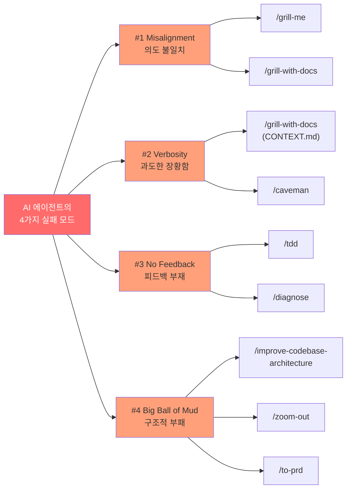
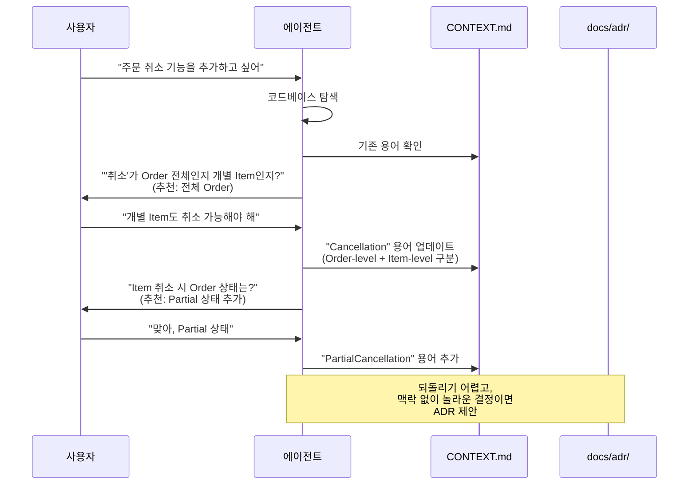
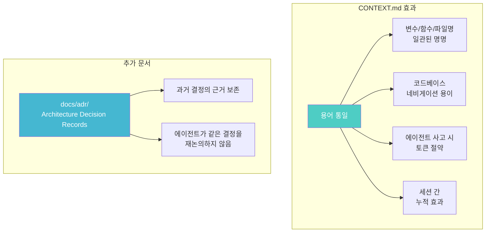
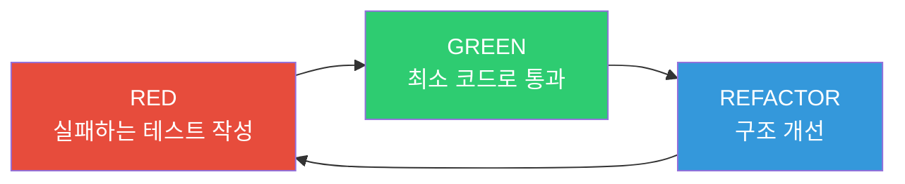
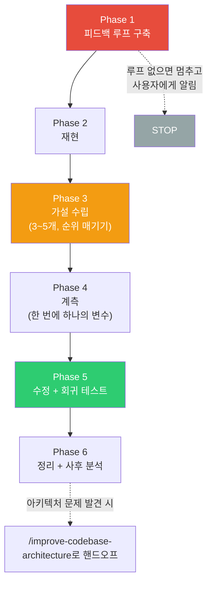
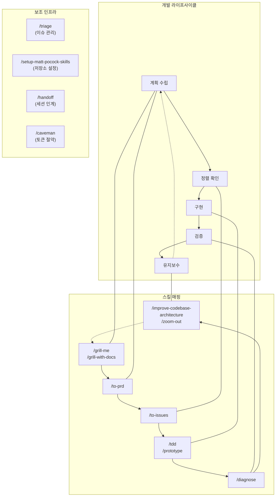

> **대상 저장소**: [mattpocock/skills](https://github.com/mattpocock/skills)  
> **작성 기준일**: 2026-05-14

→ **2부: 스킬 해부학**은 [여기](/posts/matt-pocock-skills-analysis-2/)에서 계속됩니다.

---

## 목차
- [먼저 알아야 할 문서들: CONTEXT.md, ADR, LANGUAGE.md](#먼저-알아야-할-문서들-contextmd-adr-languagemd)
- [제 1 장 — 왜 에이전트는 실패하는가: 문제 진단과 스킬이라는 처방전](#제-1-장--왜-에이전트는-실패하는가-문제-진단과-스킬이라는-처방전)
  - [문제 #1: 에이전트가 내 의도를 이해하지 못한다 (Misalignment)](#문제-1-에이전트가-내-의도를-이해하지-못한다)
  - [문제 #2: 에이전트가 너무 장황하다 (Verbosity)](#문제-2-에이전트가-너무-장황하다)
  - [문제 #3: 코드가 작동하지 않는다 (No Feedback Loop)](#문제-3-코드가-작동하지-않는다)
  - [문제 #4: 진흙 덩어리를 만들었다 (Big Ball of Mud)](#문제-4-진흙-덩어리를-만들었다)
  - [문제-해결 전체 맵](#문제-해결-전체-맵)
- [부록: 주요 개념 용어집](#부록-주요-개념-용어집)

---

## 먼저 알아야 할 문서들: CONTEXT.md, ADR, LANGUAGE.md

이 저장소의 핵심 스킬들은 단순히 "프롬프트를 잘 쓰는 법"이 아니라, 에이전트가 반복해서 참고할 **문서화된 기억**을 전제로 한다. 문제 #1~#4를 읽기 전에 아래 문서들의 역할을 먼저 구분하면 이후 처방전이 훨씬 덜 헷갈린다.

| 문서 | 위치 | 한 줄 정의 | 누가 주로 사용하나 |
|------|------|------------|------------------|
| **CONTEXT.md** | 저장소 루트 또는 각 컨텍스트 디렉토리 | 프로젝트 고유의 도메인 용어, 관계, 모호함을 정리한 공유 언어 문서 | `/grill-with-docs`, `/tdd`, `/diagnose`, `/improve-codebase-architecture`, `/zoom-out` |
| **CONTEXT-MAP.md** | 저장소 루트 | 모노레포처럼 여러 도메인 컨텍스트가 있을 때, 각 `CONTEXT.md`의 위치와 관계를 알려주는 지도 | 도메인 문서를 읽는 모든 엔지니어링 스킬 |
| **ADR** | `docs/adr/0001-slug.md` 형식 | Architecture Decision Record의 약어. 되돌리기 어렵고 맥락 없이는 이상해 보이는 아키텍처 결정을 "왜 그렇게 했는지"와 함께 기록 | `/grill-with-docs`, `/improve-codebase-architecture`, `/tdd`, `/diagnose` |
| **LANGUAGE.md** | `improve-codebase-architecture/` 내부 | 특정 프로젝트의 도메인 언어가 아니라, 아키텍처를 논의할 때 쓰는 공통 어휘 사전 | `/improve-codebase-architecture` |
| **docs/agents/domain.md** | `/setup-matt-pocock-skills`가 생성 | 에이전트가 이 저장소에서 도메인 문서를 어디서 읽어야 하는지 알려주는 소비 규칙 | 설정 이후의 엔지니어링 스킬 |

**CONTEXT.md**는 "이 프로젝트에서 이 단어는 정확히 무엇을 뜻하는가"를 정한다. 예를 들어 커머스 코드베이스에서 `Customer`, `User`, `Account`가 섞이면 에이전트는 셋을 마음대로 바꿔 쓴다. `CONTEXT.md`는 canonical term을 하나 고르고, 피해야 할 동의어와 관계를 기록한다. 일반 프로그래밍 용어가 아니라 프로젝트 고유의 도메인 언어만 들어간다.

**ADR**은 Architecture Decision Record의 약어다. 데이터베이스 선택, 컨텍스트 간 통신 방식, ORM 대신 SQL을 쓰기로 한 이유처럼 나중에 다시 논쟁하기 쉬운 결정을 작게 기록한다. 이 저장소의 ADR은 거창한 템플릿이 아니라 1~3문장짜리 문서도 허용한다. 핵심은 "결정했다"와 "그 이유"를 남겨 미래의 사람과 에이전트가 같은 논쟁을 반복하지 않게 하는 것이다.

**LANGUAGE.md**는 `CONTEXT.md`와 결이 비슷하지만 대상이 다르다. `CONTEXT.md`가 주문, 강의, 결제 같은 **비즈니스 도메인 언어**라면, `LANGUAGE.md`는 Module, Interface, Depth, Seam, Adapter, Leverage, Locality 같은 **아키텍처 분석 언어**다. `/improve-codebase-architecture`가 `component`, `service`, `API`, `boundary` 같은 애매한 말을 피하고 같은 기준으로 리팩토링 후보를 설명하게 만든다.

**관련 보조 문서**도 있다. `CONTEXT-FORMAT.md`와 `ADR-FORMAT.md`는 각각 `CONTEXT.md`와 ADR을 어떤 형식으로 작성할지 알려주는 템플릿 문서다. `docs/agents/issue-tracker.md`, `docs/agents/triage-labels.md`, `docs/agents/domain.md`는 `/setup-matt-pocock-skills`가 만드는 저장소별 운영 설정으로, 스킬들이 이슈 트래커와 도메인 문서 위치를 찾는 데 사용한다.

---

# 제 1 장 — 왜 에이전트는 실패하는가: 문제 진단과 스킬이라는 처방전

> *다른 사람의 스킬을 이해하는 가장 좋은 방법은, 어떤 문제점으로부터 그 스킬이 필요해졌는지를 이해하는 것이다.*

Matt Pocock은 README에서 AI 에이전트의 네 가지 구조적 실패 모드(failure mode)를 식별하고, 각 실패 모드에 대응하는 스킬을 제시한다. 이 접근은 "vibe coding"이 아닌 **실제 소프트웨어 엔지니어링 원칙**에 기반한다.



---

## 문제 #1: 에이전트가 내 의도를 이해하지 못한다

> *"No-one knows exactly what they want"*
> — David Thomas & Andrew Hunt, *The Pragmatic Programmer*

### 문제 진단

소프트웨어 개발에서 가장 흔한 실패 모드는 **미스얼라인먼트(misalignment)**다. 개발자가 알고 있다고 생각하는 것과, 에이전트가 이해한 것 사이에 간극이 존재한다. 사람 간 커뮤니케이션에서도 동일한 문제가 발생하지만, AI 에이전트는 "명확해질 때까지 질문한다"는 습관이 약하기 때문에 이 간극이 더 크다.

### 처방전: `/grill-me`와 `/grill-with-docs`

**핵심 메커니즘은 "그릴링 세션(grilling session)"**이다. 에이전트가 사용자에게 설계와 계획에 대해 집요하게 질문을 던져, 의사결정 트리(decision tree)의 모든 가지를 하나씩 해소한다.

#### `/grill-me` — 범용 그릴링

SKILL.md에서 핵심 지시문을 인용하면:

> *"Interview me relentlessly about every aspect of this plan until we reach a shared understanding. Walk down each branch of the design tree, resolving dependencies between decisions one-by-one. For each question, provide your recommended answer."*

핵심 규칙:
- **질문은 한 번에 하나씩** — 사용자가 답변한 후 다음 질문으로 진행
- **코드베이스 탐색으로 답할 수 있는 질문은 직접 탐색** — 사용자에게 불필요한 부담을 주지 않음
- **각 질문에 에이전트의 추천 답변 제시** — 사용자가 "맞다/아니다"로 빠르게 결정할 수 있음

#### `/grill-with-docs` — 도메인 인식 그릴링

`/grill-me`의 상위 호환. 동일한 그릴링 구조 위에 **도메인 문서 관리** 계층을 추가한다:

> *"When the user uses a term that conflicts with the existing language in CONTEXT.md, call it out immediately."*

**실제 효과를 내는 메커니즘들:**

| 메커니즘 | SKILL.md 근거/예시 | 의도하는 효과 |
|---------|-------------|-------------|
| 용어 충돌 감지 | *"Your glossary defines 'cancellation' as X, but you seem to mean Y — which is it?"* | 도메인 용어의 일관성 강제 |
| 모호한 언어 날카롭게 만들기 | *"You're saying 'account' — do you mean the Customer or the User?"* | 오버로드된 용어 해소 |
| 구체적 시나리오 검증 | *"stress-test them with specific scenarios... Invent scenarios that probe edge cases"* | 엣지 케이스를 사전에 발견 |
| 코드와 교차 검증 | *"check whether the code agrees. If you find a contradiction, surface it"* | 코드와 설계 사이의 불일치 탐지 |
| CONTEXT.md 즉시 업데이트 | *"When a term is resolved, update CONTEXT.md right there. Don't batch these up"* | 결정이 날 때마다 문서에 즉각 반영 |
| ADR 후보 여부 판단 | 결정이 "나중에 바꾸기 어렵고", "맥락 없이는 이상해 보이며", "실제 대안 사이의 선택"인지 확인한다. 예: 동기 HTTP 대신 도메인 이벤트로 컨텍스트를 연결하기로 한 결정 | 미래의 사람/에이전트가 같은 논쟁을 반복하거나 의도적 결정을 되돌리지 않게 함 |



---

## 문제 #2: 에이전트가 너무 장황하다

> *"With a ubiquitous language, conversations among developers and expressions of the code are all derived from the same domain model."*
> — Eric Evans, *Domain-Driven Design*

### 문제 진단

에이전트가 프로젝트에 투입될 때, 프로젝트 고유의 전문 용어(jargon)를 모른다. 그래서 **한 단어로 충분한 곳에 20단어를 사용**한다. 이는 단순히 출력이 길어지는 문제가 아니다:
- 변수명과 함수명이 일관되지 않고
- 코드베이스 네비게이션이 어려워지고
- 에이전트가 사고(thinking)에 불필요한 토큰을 소비한다

### 핵심 개념: 유비쿼터스 언어 (Ubiquitous Language)

**유비쿼터스 언어**는 Eric Evans의 *Domain-Driven Design*에서 나온 개념이다. 개발자, 도메인 전문가, 그리고 코드 자체가 **동일한 용어 체계**를 공유해야 한다는 원칙이다.

예를 들어, 강의 관리 시스템에서:
- **Before** (유비쿼터스 언어 없음): "강좌 안의 섹션 안에 있는 레슨이 파일 시스템에 실제로 배치되는 과정에 문제가 있어요"
- **After** (유비쿼터스 언어 적용): "materialization cascade에 문제가 있어요"

### 처방전: `CONTEXT.md` + `/grill-with-docs`

문제 #2의 처방은 앞 절에서 설명한 `CONTEXT.md`를 실제 세션 중에 계속 갱신하는 것이다. README의 표현대로, 이 문서는 에이전트가 프로젝트에서 쓰는 jargon을 해독하도록 돕는다.

`CONTEXT.md`의 포맷(CONTEXT-FORMAT.md에서 발췌):

```markdown
# {Context Name}
{이 컨텍스트가 무엇인지, 왜 존재하는지 1-2문장}

## Language
**Order**: 고객이 접수하는 주문
_Avoid_: Purchase, transaction

**Invoice**: 배송 후 고객에게 보내는 결제 요청서
_Avoid_: Bill, payment request

## Relationships
- **Order** → 하나 이상의 **Invoice** 생성
- **Invoice** → 정확히 하나의 **Customer**에 속함

## Example dialogue
> **Dev:** "**Customer**가 **Order**를 접수하면, 즉시 **Invoice**를 만드나요?"
> **Domain expert:** "아니요 — **Fulfillment**이 확인된 후에만 **Invoice**가 생성됩니다."

## Flagged ambiguities
- "account"이 **Customer**와 **User** 모두를 가리키는 데 사용됨 — 해소: 별개 개념.
```

핵심 규칙(CONTEXT-FORMAT.md 인용):

> *"Be opinionated. When multiple words exist for the same concept, pick the best one and list the others as aliases to avoid."*

> *"Only include terms specific to this project's context. General programming concepts don't belong."*

이 문서는 `/grill-with-docs` 세션 중에 **용어가 확정될 때마다 즉시 업데이트**된다.

배치 처리하지 않는다 - 대화 중 발견한 용어 변경 사항을 메모만 해두었다가 마지막에 한꺼번에 정리하지 않는다.
예를 들어 사용자가 "account는 Customer가 아니라 로그인 주체인 User를 뜻한다"고 답하는 순간, 바로 `CONTEXT.md`의 `Account/User/Customer` 정의와 피해야 할 표현을 갱신한다.
그래야 다음 질문, 다음 코드 탐색, 다음 테스트 이름이 곧바로 새 용어 체계를 사용한다.



---

## 문제 #3: 코드가 작동하지 않는다

> *"Always take small, deliberate steps. The rate of feedback is your speed limit."*
> — David Thomas & Andrew Hunt, *The Pragmatic Programmer*

### 문제 진단

에이전트와 의도가 정렬되어도, **피드백 루프(feedback loop)**가 없으면 코드 품질은 보장되지 않는다. 에이전트가 작성한 코드가 실제로 동작하는지에 대한 피드백 없이는, 에이전트는 시야 없이 비행(flying blind)하는 것과 같다.

### 핵심 개념: Red-Green-Refactor Loop

**Red-Green-Refactor**는 TDD(Test-Driven Development)의 핵심 리듬이다:

1. **RED**: 실패하는 테스트를 먼저 작성
2. **GREEN**: 테스트를 통과하는 최소한의 코드 작성
3. **REFACTOR**: 테스트가 통과하는 상태에서 코드 구조 개선



실체를 더 구체적으로 보면 다음과 같다.

**실패하는 테스트**는 "문법이 깨진 테스트"가 아니다. 아직 구현되지 않은 사용자 관찰 동작을 검증하기 때문에 실패하는 테스트다. 실패 이유도 중요하다. 함수가 없거나, 반환값이 기대와 다르거나, 아직 지원하지 않는 동작이라 실패해야 한다. 설정 오류나 오타로 실패하면 좋은 RED가 아니다.

```ts
// RED: 아직 priceCart가 할인 쿠폰을 처리하지 못하므로 실패해야 한다.
test("applies a percentage coupon to the cart total", () => {
  const result = priceCart({ total: 10000 }, { type: "percent", value: 10 });

  expect(result.total).toBe(9000);
});
```

**최소 코드로 통과한다**는 말은 이번 테스트가 요구한 동작만 구현한다는 뜻이다. 미래에 필요할 것 같은 쿠폰 만료, 중복 쿠폰, 통화 변환까지 미리 만들지 않는다.

```ts
// GREEN: 현재 테스트가 요구한 percent 쿠폰만 통과시킨다.
function priceCart(cart: { total: number }, coupon: { type: "percent"; value: number }) {
  return {
    total: cart.total - cart.total * (coupon.value / 100),
  };
}
```

**구조 개선**은 테스트가 GREEN인 상태에서만 한다. 예를 들어 다음 테스트로 고정 금액 쿠폰까지 추가한 뒤 중복 계산이 보이면, 공개 인터페이스 `priceCart`는 유지하고 내부 계산만 분리한다.

```ts
function priceCart(cart: Cart, coupon: Coupon) {
  return {
    total: cart.total - calculateDiscountAmount(cart.total, coupon),
  };
}

function calculateDiscountAmount(total: number, coupon: Coupon) {
  if (coupon.type === "percent") return total * (coupon.value / 100);
  return coupon.value;
}
```

이 리팩토링은 새 기능을 추가하지 않는다. 이미 통과하던 테스트가 계속 통과하는 상태에서 중복을 줄이고, 이름을 명확히 하고, 복잡도를 더 알맞은 내부 함수나 모듈 뒤로 옮기는 작업이다.

### 핵심 개념: Vertical Slice (수직 슬라이스)

**Vertical Slice**는 시스템의 모든 계층(layer)을 관통하는 얇은 기능 단위다. "UI 전체 → API 전체 → DB 전체"처럼 한 레이어씩 완성하는 수평 슬라이스와 반대다. 예를 들어 결제 기능을 만들 때 먼저 DB 스키마 전체를 완성하고, 그다음 API 전체를 만들고, 마지막에 UI를 붙이는 방식이 아니라, "유효한 장바구니 하나를 결제하면 주문이 confirmed가 된다"라는 아주 좁은 기능 하나가 UI/API/도메인/DB/테스트를 모두 통과하게 만든다.


### 처방전: `/tdd`

SKILL.md의 핵심 철학:

> *"Tests should verify behavior through public interfaces, not implementation details. Code can change entirely; tests shouldn't."*

이 문장은 "테스트는 내부 구현을 감시하지 말고, 사용자가 관찰할 수 있는 동작을 공개 인터페이스로 검증하라"는 뜻이다. 예를 들어 `checkout()` 내부에서 `paymentService.process()`를 호출하는지 spy로 확인하면, 결제 로직을 리팩토링하는 순간 테스트가 깨진다. 반대로 `checkout(cart, paymentMethod)`를 호출했을 때 주문 상태가 `confirmed`가 되고 영수증이 발급되는지를 검증하면, 내부 구현이 함수형이든 클래스로 바뀌든 테스트는 유지된다.

TDD 스킬이 강제하는 Anti-Pattern 방지(SKILL.md 인용):

> *"DO NOT write all tests first, then all implementation. This is 'horizontal slicing' — treating RED as 'write all tests' and GREEN as 'write all code.' This produces **crap tests**."*

이 말은 "테스트를 먼저 쓰라"를 "상상 가능한 테스트를 전부 한 번에 쓰라"로 오해하지 말라는 뜻이다. 한 번에 테스트 20개를 쓰면 실제 구현을 배우기 전에 테스트 구조를 고정하게 된다. 그러면 테스트가 사용자 동작보다 데이터 모양, 함수 이름, 내부 호출 순서에 묶이기 쉽다.

올바른 접근(Vertical Slice via Tracer Bullet):

```
RIGHT (vertical):
  RED→GREEN: test1→impl1
  RED→GREEN: test2→impl2
  RED→GREEN: test3→impl3
```

**좋은 테스트 vs 나쁜 테스트** (tests.md 인용):

| 구분 | 좋은 테스트 | 나쁜 테스트 |
|-----|----------|----------|
| 대상 | 공개 인터페이스를 통한 동작 검증 | 내부 구현 세부사항 검증 |
| 생존성 | 리팩토링 후에도 통과 | 리팩토링하면 깨짐 |
| 읽기 | 스펙처럼 읽힘 ("user can checkout with valid cart") | 구현 방법 기술 ("checkout calls paymentService.process") |
| 모킹 | 시스템 경계에서만 (외부 API, DB) | 내부 모듈끼리 모킹 |

예를 들어 좋은 테스트는 "유효한 쿠폰을 적용하면 총액이 할인된다"라고 말한다. 나쁜 테스트는 "`CouponService.calculate()`가 정확히 한 번 호출된다"라고 말한다. 전자는 비즈니스 동작을 보호하고, 후자는 현재 구현 방식을 얼려버린다.

### 처방전: `/diagnose`

SKILL.md에서 가장 강력한 선언:

> *"**This is the skill.** Everything else is mechanical. If you have a fast, deterministic, agent-runnable pass/fail signal for the bug, you will find the cause."*

이 선언에서 말하는 핵심은, 버그를 잡기 전에 먼저 **버그가 아직 존재하는지 자동으로 판정하는 장치**를 만들라는 것이다. 여기서 pass/fail 신호는 "고쳤는지 아닌지"를 사람이 감으로 판단하지 않아도 알려주는 실행 가능한 확인 방법이다. 빠르다는 것은 여러 번 돌려도 부담이 없다는 뜻이고, deterministic하다는 것은 같은 코드와 같은 입력이면 같은 결과가 나온다는 뜻이며, agent-runnable하다는 것은 에이전트가 직접 명령어, 테스트, 스크립트로 실행할 수 있다는 뜻이다.

예를 들어 "쿠폰이 두 번 적용된다"는 버그가 있으면, 좋은 신호는 `pnpm test coupon-replay`처럼 실행했을 때 버그가 있으면 빨간색으로 실패하고, 고치면 초록색으로 통과하는 테스트다. 나쁜 신호는 "브라우저에서 몇 번 눌러보면 가끔 이상하다"처럼 느리고, 사람 손이 필요하고, 성공/실패 기준이 흐린 확인 방식이다. 좋은 신호가 있으면 에이전트는 가설을 하나씩 검증할 수 있다. 신호가 없으면 수정처럼 보이는 변경을 해도 실제 버그를 고쳤는지 알 수 없다.

6단계 진단 루프:



여기서 **회귀 테스트(regression test)**는 "한 번 고친 버그가 다시 생기면 바로 실패하는 테스트"다. 버그 수정 직전에 그 버그를 재현하는 테스트를 추가하고, 먼저 실패하는지 확인한 뒤, 수정 후 통과하게 만든다. 이렇게 하면 이번 수정이 우연히 증상을 가린 것인지 실제 원인을 막은 것인지 확인할 수 있고, 미래의 변경이 같은 버그를 되살리면 테스트가 즉시 알려준다.

예시로 "쿠폰이 가끔 두 번 적용되어 결제 금액이 10%가 아니라 20% 할인된다"는 버그를 진단한다고 하자.

| Phase | 실제 예시 |
|-------|----------|
| 1. 피드백 루프 구축 | 장바구니 생성 → 쿠폰 적용 → 체크아웃 API 호출 → 총액이 9000원인지 확인하는 통합 테스트나 `curl` 스크립트를 만든다. 사람이 브라우저를 클릭해야만 재현된다면 Playwright나 HITL 스크립트로 반복 가능하게 만든다. |
| 2. 재현 | 루프를 여러 번 실행해 사용자가 말한 증상과 같은 실패인지 확인한다. 예를 들어 기대값 9000원인데 실제 8000원이 나오는지, 아니면 전혀 다른 500 에러인지 구분한다. |
| 3. 가설 수립 | 3~5개 가설을 순위로 세운다. 예: 1) 쿠폰 이벤트가 두 번 처리된다. 2) 재시도 로직이 idempotency key를 잃는다. 3) 프론트엔드가 Apply 버튼을 중복 제출한다. 각 가설은 "X가 원인이면 Y를 바꾸면 실패가 사라진다"처럼 반증 가능해야 한다. |
| 4. 계측 | `[DEBUG-coupon-replay]` 같은 고유 태그로 주문 생성, 쿠폰 적용, 결제 직전 금액 경계에만 로그를 넣는다. 한 번에 한 변수만 바꿔 어떤 가설이 맞는지 확인한다. |
| 5. 수정 + 회귀 테스트 | 실제 원인이 이벤트 중복 처리라면, 먼저 "같은 쿠폰 이벤트를 두 번 replay해도 총액은 한 번만 할인된다"는 테스트를 만든다. 이 테스트는 수정 전에는 8000원이 나와 실패해야 한다. 그다음 이벤트 ID나 idempotency key를 기준으로 이미 처리한 쿠폰 이벤트를 무시하도록 고친다. 수정 후 같은 테스트가 9000원으로 통과하면, 버그를 재현하던 사례가 테스트로 잠겼다는 뜻이다. 마지막으로 원래의 더 큰 피드백 루프도 다시 실행해 실제 사용자 시나리오에서도 문제가 사라졌는지 확인한다. |
| 6. 정리 + 사후 분석 | 디버그 로그를 모두 제거하고, 원래 루프와 새 회귀 테스트를 다시 실행한다. 좋은 테스트 seam이 없어서 임시 하네스로만 막았다면, 그 사실을 기록하고 `/improve-codebase-architecture`로 구조 개선 후보를 넘긴다. |

> *"Build the right feedback loop, and the bug is 90% fixed."*

---

## 문제 #4: 진흙 덩어리를 만들었다

> *"Invest in the design of the system every day."*
> — Kent Beck, *Extreme Programming Explained*

> *"The best modules are deep. They allow a lot of functionality to be accessed through a simple interface."*
> — John Ousterhout, *A Philosophy of Software Design*

### 문제 진단

에이전트가 코딩 속도를 급격히 높이면, **소프트웨어 엔트로피(software entropy)**도 전례 없는 속도로 가속된다. 결과물은 복잡하고 변경하기 어려운 코드베이스, 즉 "Big Ball of Mud"가 된다.

### 핵심 개념: Deep Module vs Shallow Module

John Ousterhout의 *A Philosophy of Software Design*에서 나온 개념이다. **Deep Module**은 작은 인터페이스 뒤에 많은 동작과 복잡도를 숨긴다. 호출자는 적은 것만 알면 큰 기능을 얻는다. **Shallow Module**은 반대로 인터페이스가 구현만큼 복잡하다. 호출자가 알아야 할 것이 많고, 모듈 안에는 전달(pass-through) 로직만 얇게 있다.

예를 들어 주문 가격 계산을 생각해보자.

| 형태 | 예시 | 결과 |
|------|------|------|
| Deep Module | `priceOrder(order, pricingContext)` 하나가 쿠폰, 세금, 반올림, 통화 규칙, 예외 조건을 내부에 숨김 | 호출자는 가격 계산 규칙을 몰라도 되고, 테스트도 가격 계산 인터페이스 하나를 통과하면 됨 |
| Shallow Module | 호출자가 `validateCoupon`, `applyCoupon`, `calculateTax`, `roundMoney`, `convertCurrency`를 순서대로 직접 호출하고 중간 상태를 관리 | 파일은 나뉘었지만 복잡도는 호출자에게 남아 있음. 호출 순서가 바뀌면 버그가 나고, 테스트도 내부 단계에 묶임 |

중요한 점은 "파일이 작다"가 곧 좋은 설계가 아니라는 것이다. 작은 함수가 많아도 호출자가 조립법을 전부 알아야 하면 shallow하다. 반대로 내부 구현이 길어도 인터페이스가 작고 호출자에게 높은 레버리지를 제공하면 deep할 수 있다.


### 처방전: `/improve-codebase-architecture`

SKILL.md의 목적:

> *"Surface architectural friction and propose **deepening opportunities** — refactors that turn shallow modules into deep ones. The aim is testability and AI-navigability."*

이 스킬은 "코드를 더 예쁘게 정리하자"가 아니라, 코드를 이해하고 변경하고 테스트할 때 실제로 마찰이 생기는 지점을 찾는다. 그리고 그 마찰을 줄이기 위해 shallow module을 deep module로 바꾸는 리팩토링 후보를 제안한다. 목표는 두 가지다. 테스트가 내부 구현이 아니라 올바른 인터페이스를 통과하게 만들고, 에이전트가 코드베이스를 탐색할 때 덜 헤매게 만드는 것이다.

이 스킬은 전용 아키텍처 용어 사전(LANGUAGE.md)을 사용한다. 아래 표는 스킬이 아키텍처 제안을 할 때 반드시 같은 의미로 쓰도록 고정한 어휘 목록이다.

| 용어 | 정의 | 사용 금지 동의어 |
|-----|------|---------------|
| **Module** | 인터페이스와 구현을 가진 모든 것 (함수, 클래스, 패키지) | unit, component, service |
| **Interface** | 호출자가 알아야 할 모든 것 (타입 + 불변식 + 에러 모드 + 설정) | API, signature |
| **Depth** | 인터페이스 대비 레버리지의 크기 | — |
| **Seam** | 인터페이스가 존재하는 위치 (Michael Feathers) | boundary |
| **Adapter** | Seam에서 인터페이스를 만족시키는 구체적인 것 | — |
| **Leverage** | 호출자가 Depth로부터 얻는 것 | — |
| **Locality** | 유지보수자가 Depth로부터 얻는 것 (변경/버그/지식의 집중) | — |

"사용 금지 동의어"는 일상적으로 비슷해 보이지만 이 스킬의 분석에서는 의미를 흐리기 쉬운 단어들이다.
예를 들어 여기서 **Interface**는 TypeScript `interface`나 함수 시그니처만 뜻하지 않는 넓은 범주의 용어이기 때문에 `API`나 `signature`로 바꿔 쓰지 않는다.

**Deletion Test** (LANGUAGE.md 인용):

> *"Imagine deleting the module. If complexity vanishes, it was a pass-through. If complexity reappears across N callers, it was earning its keep."*

Deletion Test는 "이 모듈을 지우면 복잡도가 어디로 가는가"를 묻는 사고 실험이다. 모듈을 삭제했는데 호출자 코드가 오히려 단순해지거나 별 변화가 없다면, 그 모듈은 복잡도를 숨기지 못하고 이름만 붙인 pass-through였을 가능성이 크다. 반대로 모듈을 삭제하는 순간 같은 로직이 여러 호출자에 복제되고, 호출 순서와 예외 처리가 여기저기 퍼진다면, 그 모듈은 자기 역할을 하고 있던 것이다.

예를 들어 `OrderPricing`을 지웠더니 모든 checkout, quote, invoice 코드가 쿠폰/세금/반올림 규칙을 직접 알아야 한다면 `OrderPricing`은 가치 있는 deep module이다. 반대로 `OrderPricing.calculate()`가 단순히 `calculateOrderPricing()` 한 줄을 다시 호출할 뿐이고 호출자가 여전히 모든 플래그와 중간값을 조립해야 한다면 shallow module이다.

3단계 프로세스(탐색 → 후보 제시 → 그릴링 루프)는 다음처럼 작동한다.

| 단계 | 의미 | 예시 |
|------|------|------|
| 1. Explore | `CONTEXT.md`와 ADR을 읽고 코드베이스를 유기적으로 탐색하며 마찰 지점을 찾는다 | 결제 금액을 이해하려면 `CouponRules`, `TaxHelpers`, `CurrencyFormatter`, `CheckoutController`를 계속 왕복해야 한다는 사실을 발견 |
| 2. Present candidates | deepening opportunity를 번호 목록으로 제시한다. 아직 인터페이스 설계안은 내지 않는다 | "1. 가격 계산 규칙을 `OrderPricing` 모듈 뒤로 모으기 — locality가 생기고 테스트 seam이 명확해짐" |
| 3. Grilling loop | 사용자가 고른 후보에 대해 설계 트리를 질문으로 좁힌다 | `OrderPricing`의 입력은 `Order` 전체인가, 가격에 필요한 스냅샷인가? 세금 서비스는 내부 adapter인가 외부 port인가? 어떤 테스트가 인터페이스를 통과해야 하는가? |

이 과정에서 새 도메인 용어가 확정되면 `CONTEXT.md`를 갱신하고, 사용자가 특정 리팩토링 후보를 중요한 이유로 거절하면 ADR로 남길지 제안한다. 예를 들어 "가격 계산을 모듈화하지 않는 이유가 외부 파트너 계약상 계산 단계별 감사 로그가 필요하기 때문"이라면, 미래의 아키텍처 리뷰가 같은 제안을 반복하지 않도록 ADR 후보가 된다.

### 보조 스킬들

**`/zoom-out`** — 코드의 상위 추상화 계층을 보여줌:

> *"Go up a layer of abstraction. Give me a map of all the relevant modules and callers, using the project's domain glossary vocabulary."*

`disable-model-invocation: true` 플래그가 설정되어 있어, 별도 모델 호출 없이 즉시 동작한다.

**`/to-prd`** — 대화 맥락을 PRD로 변환 (모듈 설계 포함):

> *"Sketch out the major modules you will need to build or modify... Actively look for opportunities to extract deep modules that can be tested in isolation."*

---

## 문제-해결 전체 맵




---

## 부록: 주요 개념 용어집

| 영어 용어 | 한국어 설명 |
|----------|------------|
| **Grilling Session** | 에이전트가 사용자에게 집요하게 질문하여 모호함을 해소하는 대화 패턴. |
| **Ubiquitous Language** | *Domain-Driven Design*에서 유래. 개발자, 도메인 전문가, 코드가 공유하는 단일 용어 체계. |
| **ADR (Architecture Decision Record)** | 아키텍처 결정과 그 근거를 기록하는 경량 문서. |
| **Red-Green-Refactor Loop** | TDD의 핵심 리듬. 실패하는 테스트(Red) → 최소 코드로 통과(Green) → 구조 개선(Refactor)을 반복. |
| **Vertical Slice** | 시스템의 모든 계층(UI, API, DB, 테스트)을 관통하는 얇은 기능 단위. Horizontal Slice(한 계층씩 완성)의 반대. |
| **Tracer Bullet** | *The Pragmatic Programmer*에서 유래. 전체 경로를 관통하는 최소한의 end-to-end 구현. 첫 Vertical Slice. |
| **Deep Module** | *A Philosophy of Software Design*에서 유래. 작은 인터페이스 뒤에 많은 기능을 숨기는 모듈. 높은 레버리지. |
| **Shallow Module** | 인터페이스가 구현만큼 복잡한 모듈. 추상화의 가치가 낮음. |
| **Seam** | *Working Effectively with Legacy Code*에서 유래. 코드를 편집하지 않고도 동작을 변경할 수 있는 지점. |
| **Deletion Test** | 모듈을 삭제했을 때 복잡성이 사라지면 pass-through, 호출자에 퍼지면 가치 있는 모듈. |

---

*이 문서는 mattpocock/skills 저장소의 배경 문서와 에이전트 실패 모드를 분석한 것입니다. 스킬별 상세 해부학은 [2부](/posts/matt-pocock-skills-analysis-2/)에서 이어집니다.*
