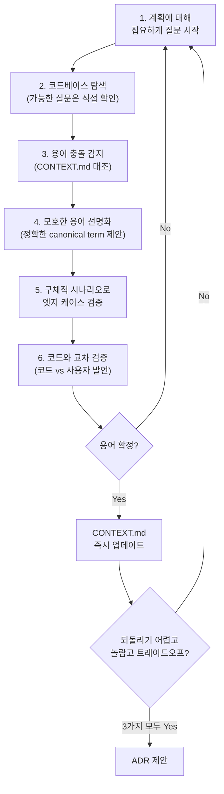
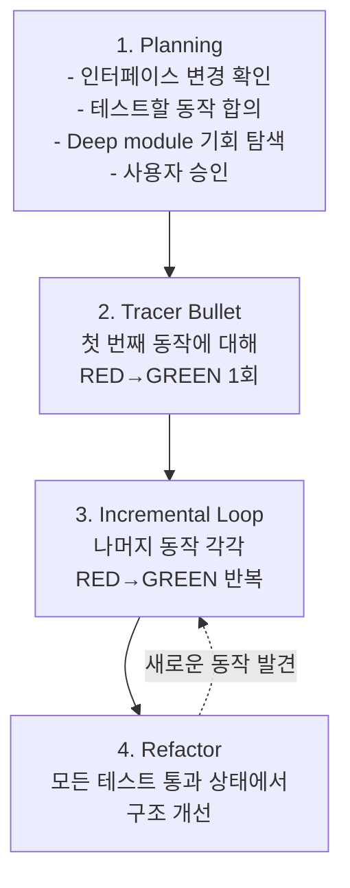
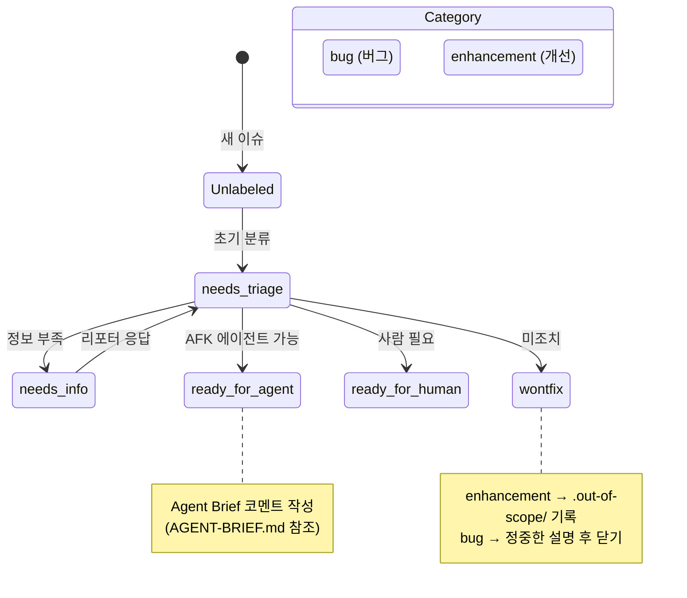
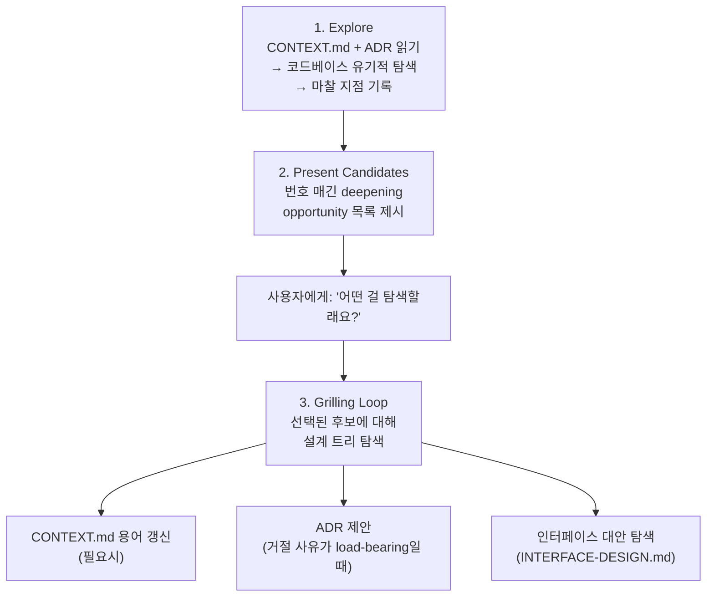
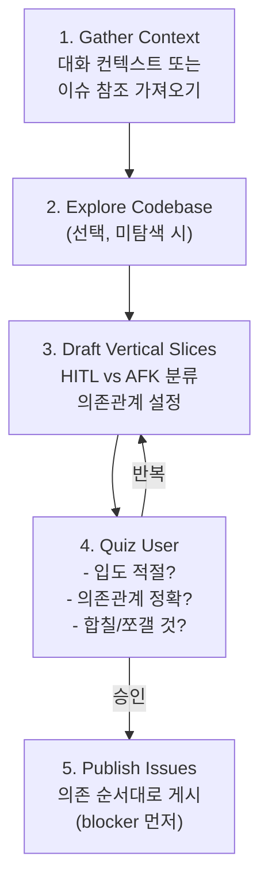
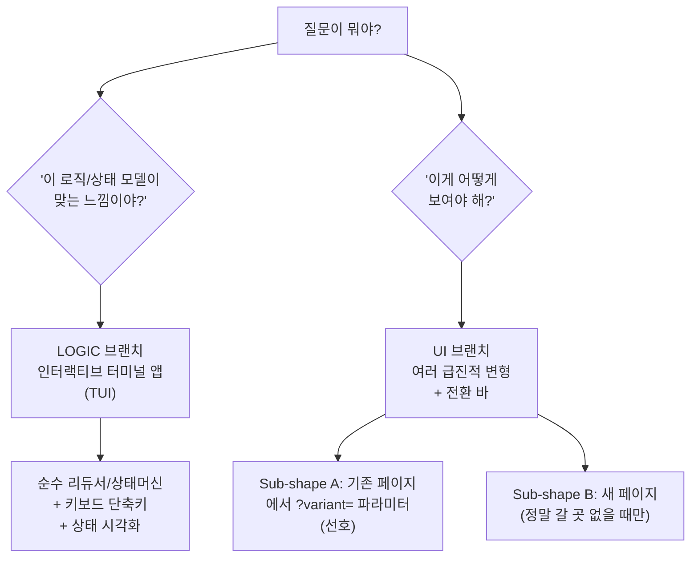
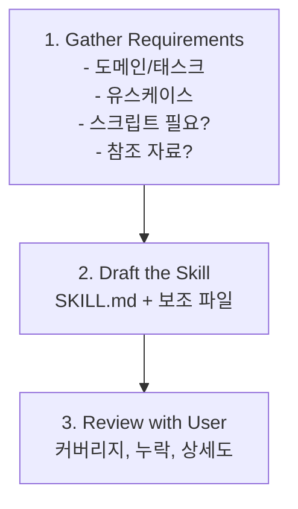

> **대상 저장소**: [mattpocock/skills](https://github.com/mattpocock/skills)  
> **작성 기준일**: 2026-05-14

← **1부: 왜 에이전트는 실패하는가**는 [여기](/posts/matt-pocock-skills-analysis-1/)에서 볼 수 있습니다.

---

## 목차
- [제 2 장 — 스킬 해부학: 각 스킬의 의도, 구조, 동작 원리](#제-2-장--스킬-해부학-각-스킬의-의도-구조-동작-원리)
  - [Engineering 스킬](#engineering-스킬)
    - [`/grill-with-docs`](#grill-with-docs)
    - [`/tdd`](#tdd)
    - [`/diagnose`](#diagnose)
    - [`/triage`](#triage)
    - [`/improve-codebase-architecture`](#improve-codebase-architecture)
    - [`/to-prd`](#to-prd)
    - [`/to-issues`](#to-issues)
    - [`/prototype`](#prototype)
    - [`/zoom-out`](#zoom-out)
    - [`/setup-matt-pocock-skills`](#setup-matt-pocock-skills)
  - [Productivity 스킬](#productivity-스킬)
    - [`/grill-me`](#grill-me)
    - [`/caveman`](#caveman)
    - [`/handoff`](#handoff)
    - [`/write-a-skill`](#write-a-skill)
- [부록: 주요 개념 용어집](#부록-주요-개념-용어집)

---

# 제 2 장 — 스킬 해부학: 각 스킬의 의도, 구조, 동작 원리

> *어떠한 스킬을 잘 사용하려면, 그 스킬의 의도(why)와 목적(what), 그리고 동작 메커니즘(how) 대해 잘 알아야 한다.*

---

## Engineering 스킬

매일 코드 작업에 사용하는 핵심 스킬들.

---

### `/grill-with-docs`

**역할**: 도메인 모델과 대조하며 계획을 검증하는 그릴링 세션. CONTEXT.md와 ADR을 실시간 갱신.

**트리거**: 프로젝트의 언어 체계와 문서화된 결정에 대해 계획을 스트레스 테스트하고 싶을 때.

**동작 순서**:



**결과물**: 정련된 계획 + 갱신된 CONTEXT.md + (선택적) ADR 문서

**보조 파일**:
- `CONTEXT-FORMAT.md` — CONTEXT.md의 정확한 포맷 정의
- `ADR-FORMAT.md` — ADR의 최소 포맷 (`docs/adr/0001-slug.md`)

**ADR 작성 기준** (ADR-FORMAT.md 인용):

> 세 조건이 모두 참일 때만:
> 1. *"Hard to reverse"* — 나중에 바꾸는 비용이 의미 있을 때
> 2. *"Surprising without context"* — 미래 독자가 "왜 이렇게 했지?" 할 때
> 3. *"The result of a real trade-off"* — 진짜 대안이 있었고 이유가 있어서 선택했을 때

---

### `/tdd`

**역할**: Red-Green-Refactor 루프 기반의 테스트 주도 개발. Vertical Slice 단위로 기능을 구축하거나 버그를 수정.

**트리거**: TDD, red-green-refactor, 테스트 우선 개발, 통합 테스트 요청 시.

**동작 순서**:



**사이클별 체크리스트** (SKILL.md 인용):
```
[ ] Test describes behavior, not implementation
[ ] Test uses public interface only
[ ] Test would survive internal refactor
[ ] Code is minimal for this test
[ ] No speculative features added
```

**보조 파일 체계**:

| 파일 | 내용 |
|-----|------|
| `tests.md` | 좋은 테스트 vs 나쁜 테스트 예시 (코드 포함) |
| `mocking.md` | 모킹 가이드: 시스템 경계에서만, DI 활용, SDK 스타일 인터페이스 |
| `deep-modules.md` | Deep Module 개념 설명과 ASCII 다이어그램 |
| `interface-design.md` | 테스트 용이한 인터페이스 설계 3원칙 |
| `refactoring.md` | 리팩토링 후보 목록 (중복, 긴 메서드, shallow module, feature envy, primitive obsession) |

---

### `/diagnose`

**역할**: 어려운 버그와 성능 회귀에 대한 체계적 진단 루프.

**트리거**: "이거 디버깅해줘", 버그 리포트, 뭔가 깨짐/실패/에러 발생, 성능 회귀 시.

**동작 순서**:

| Phase | 이름 | 핵심 행동 | 선행 조건 |
|-------|------|---------|---------|
| 1 | **피드백 루프 구축** | 10가지 방법 중 택1로 agent-runnable pass/fail 신호 생성 | — |
| 2 | **재현** | 루프 실행, 버그 확인. 사용자 묘사와 동일한 실패인지 확인 | Phase 1 완료 |
| 3 | **가설 수립** | 3~5개 순위 매겨진 가설 생성. 각각 falsifiable 예측 포함. 사용자에게 보여주기 | Phase 2 완료 |
| 4 | **계측** | 한 번에 하나의 변수만 변경. 디버거 > 타겟 로그 > 전체 로그. 디버그 로그에 `[DEBUG-xxxx]` 태그 | Phase 3 완료 |
| 5 | **수정 + 회귀 테스트** | 올바른 seam이 있으면 회귀 테스트를 먼저 작성. 없으면 발견 사항으로 기록 | Phase 4 완료 |
| 6 | **정리 + 사후 분석** | 디버그 로그 제거, 프로토타입 삭제, 올바른 가설을 커밋 메시지에 기록 | Phase 5 완료 |

**Phase 6에서 `/improve-codebase-architecture`로 핸드오프** (SKILL.md 인용):

> *"Then ask: what would have prevented this bug? If the answer involves architectural change... hand off to the `/improve-codebase-architecture` skill with the specifics."*

---

### `/triage`

**역할**: 이슈 트래커의 이슈를 상태 머신(state machine)을 통해 분류/관리.

**트리거**: 이슈 생성, 트리아지, 버그/기능요청 리뷰, AFK 에이전트용 이슈 준비 시.

**상태 머신**:



**보조 파일**:
- `AGENT-BRIEF.md` — AFK 에이전트를 위한 브리프 작성법 (내구성 > 정밀도, 동작 기반, 파일 경로 금지)
- `OUT-OF-SCOPE.md` — 거절된 기능 요청을 `.out-of-scope/` 디렉토리에 기록하는 지식 베이스

**AI 면책 조항** (SKILL.md 인용):

> 모든 코멘트/이슈에 반드시 포함:
> *"> *This was generated by AI during triage.*"*

---

### `/improve-codebase-architecture`

**역할**: 코드베이스의 Shallow Module을 Deep Module로 전환하는 리팩토링 기회 발견.

**트리거**: 아키텍처 개선, 리팩토링 기회 탐색, 모듈 통합, 테스트 용이성/AI 네비게이션 향상 시.

**동작 순서**:



**인터페이스 설계 탐색** (INTERFACE-DESIGN.md 인용):

"Design It Twice" (Ousterhout) 원칙 기반으로, 3개 이상의 **병렬 서브 에이전트**를 생성하여 각각 급진적으로 다른 인터페이스를 설계:
- Agent 1: 최소 인터페이스 (1-3 entry point)
- Agent 2: 최대 유연성
- Agent 3: 가장 흔한 호출자에 최적화
- Agent 4: Ports & Adapters 패턴

**탐색 시 확인하는 마찰 지점** (SKILL.md 인용):
- 하나의 개념을 이해하기 위해 여러 작은 모듈을 오가야 하는 곳
- 인터페이스가 구현만큼 복잡한 Shallow Module
- 테스트 용이성만을 위해 추출된 순수 함수 (진짜 버그는 호출 방식에 숨어 있는데)
- Seam을 넘어 누수되는 결합

---

### `/to-prd`

**역할**: 현재 대화 맥락을 PRD(Product Requirements Document)로 합성하여 이슈 트래커에 게시.

**트리거**: 현재 컨텍스트에서 PRD 생성 요청 시.

**핵심 특징**: 사용자를 인터뷰하지 않는다. 이미 논의된 내용을 합성만 한다.

**동작 순서**:

1. 코드베이스 탐색 (CONTEXT.md 용어 사용)
2. **주요 모듈 스케치** — Deep Module 추출 기회 적극 탐색. 사용자에게 모듈 구조와 테스트 대상 확인
3. PRD 템플릿으로 작성 → 이슈 트래커에 `ready-for-agent` 레이블로 게시

**PRD 템플릿 구조**:
- Problem Statement → Solution → User Stories (광범위하게) → Implementation Decisions → Testing Decisions → Out of Scope → Further Notes

**프로토타입 코드 인용** (SKILL.md 인용):

> *"Exception: if a prototype produced a snippet that encodes a decision more precisely than prose can (state machine, reducer, schema, type shape), inline it... Trim to the decision-rich parts."*

---

### `/to-issues`

**역할**: 계획/스펙/PRD를 이슈 트래커의 독립적인 이슈들로 분해. Vertical Slice (Tracer Bullet) 방식.

**트리거**: 계획을 이슈로 변환, 구현 티켓 생성, 작업 분해 요청 시.

**동작 순서**:



**Vertical Slice 규칙** (SKILL.md 인용):

> - *"Each slice delivers a narrow but COMPLETE path through every layer (schema, API, UI, tests)"*
> - *"A completed slice is demoable or verifiable on its own"*
> - *"Prefer many thin slices over few thick ones"*

**HITL vs AFK**:
- **HITL** (Human-In-The-Loop): 아키텍처 결정, 디자인 리뷰 등 사람의 개입 필요
- **AFK** (Away From Keyboard): 사람 개입 없이 에이전트가 구현+머지 가능

---

### `/prototype`

**역할**: 설계 결정을 검증하기 위한 일회용 프로토타입 구축.

**트리거**: "프로토타입 해줘", "이 데이터 모델 확인해볼래", "UI 몇 가지 옵션 보여줘", "한번 만져보고 싶어" 등.

**두 갈래 분기**:



**공통 규칙** (SKILL.md 인용):
1. *"Throwaway from day one, and clearly marked as such"*
2. *"One command to run"*
3. *"No persistence by default"*
4. *"Skip the polish. No tests, no error handling"*
5. *"Surface the state"*
6. *"Delete or absorb when done"*

**LOGIC 브랜치의 핵심** (LOGIC.md 인용):

> *"Put the actual logic behind a small, pure interface that could be lifted out and dropped into the real codebase later. The TUI around it is throwaway; the logic module shouldn't be."*

로직은 순수(pure)하게, TUI는 얇은 셸(shell)로. 프로토타입의 가치는 TUI가 아니라 검증된 로직 모듈.

**UI 브랜치의 핵심** (UI.md 인용):

> *"Variants must be **structurally different** — different layout, different information hierarchy, different primary affordance, not just different colours."*

3개 이상의 급진적으로 다른 변형을, floating bottom bar로 전환하며 비교. `?variant=` URL 파라미터로 공유 가능.

---

### `/zoom-out`

**역할**: 코드의 상위 추상화 계층 맵 제공.

**트리거**: 코드 영역에 익숙하지 않거나, 전체 그림에서 어떻게 맞는지 이해하고 싶을 때.

**전체 SKILL.md**:

> *"I don't know this area of code well. Go up a layer of abstraction. Give me a map of all the relevant modules and callers, using the project's domain glossary vocabulary."*

`disable-model-invocation: true` — 별도 모델 호출 없이 즉시 적용되는 인라인 지시문. 가장 짧은 스킬이지만, 에이전트가 코드를 설명할 때의 추상화 수준을 즉시 끌어올리는 효과가 있다.

---

### `/setup-matt-pocock-skills`

**역할**: 다른 엔지니어링 스킬들이 참조하는 저장소별 설정 스캐폴딩.

**트리거**: 저장소에서 처음 mattpocock 스킬을 사용할 때. `to-issues`, `to-prd`, `triage`, `diagnose`, `tdd`, `improve-codebase-architecture`, `zoom-out` 사용 전 1회 실행.

**설정 3가지** (순서대로 하나씩 사용자에게 질문):

| 설정 | 설명 | 옵션 |
|------|------|------|
| **A. Issue Tracker** | 이슈가 어디에 있는지 | GitHub, GitLab, Local markdown, Other |
| **B. Triage Labels** | 5개 canonical role의 실제 레이블 문자열 | 기본값: `needs-triage`, `needs-info`, `ready-for-agent`, `ready-for-human`, `wontfix` |
| **C. Domain Docs** | CONTEXT.md 레이아웃 | Single-context (대부분), Multi-context (모노레포) |

**결과물**: `CLAUDE.md`(또는 `AGENTS.md`)에 `## Agent skills` 블록 추가 + `docs/agents/` 하위 3개 파일 생성.

---

## Productivity 스킬

코드에 특정되지 않는 일반 워크플로우 도구들.

---

### `/grill-me`

**역할**: 계획이나 설계에 대해 집요하게 인터뷰하여, 의사결정 트리의 모든 가지를 해소.

**트리거**: 계획 스트레스 테스트, 설계 검증, "grill me" 언급 시.

**전체 SKILL.md 지시문**:

> *"Interview me relentlessly about every aspect of this plan until we reach a shared understanding. Walk down each branch of the design tree, resolving dependencies between decisions one-by-one. For each question, provide your recommended answer."*
>
> *"Ask the questions one at a time."*
>
> *"If a question can be answered by exploring the codebase, explore the codebase instead."*

`/grill-with-docs`와의 차이: **도메인 문서 관리(CONTEXT.md, ADR)가 없다.** 코드 외 용도(비즈니스 전략, 글쓰기 계획 등)에도 사용 가능한 범용 그릴링.

---

### `/caveman`

**역할**: 초압축 커뮤니케이션 모드. 토큰 사용량 ~75% 절감.

**트리거**: "caveman mode", "less tokens", "be brief", `/caveman` 호출 시.

**규칙** (SKILL.md 인용):

> *"Drop: articles (a/an/the), filler (just/really/basically), pleasantries (sure/certainly/of course), hedging."*
>
> *"Technical terms stay exact. Code blocks unchanged. Errors quoted exact."*

**Before → After 예시**:

| Before | After |
|--------|-------|
| "Sure! I'd be happy to help you with that. The issue you're experiencing is likely caused by..." | "Bug in auth middleware. Token expiry check use `<` not `<=`. Fix:" |
| "The reason your React component is re-rendering is because you're passing inline objects as props, which creates a new reference each time." | "Inline obj prop -> new ref -> re-render. `useMemo`." |

**Auto-Clarity Exception**: 보안 경고, 되돌릴 수 없는 작업 확인, 순서가 중요한 다단계 시퀀스에서는 일시적으로 caveman 해제.

**지속성**: 한 번 활성화되면 "stop caveman" 또는 "normal mode" 전까지 **모든 응답에 적용**. 여러 턴이 지나도 자동 해제되지 않음.

---

### `/handoff`

**역할**: 현재 대화를 핸드오프 문서로 압축하여, 다른 에이전트가 이어서 작업 가능하게 함.

**트리거**: 세션 인계 요청 시.

**동작**:
1. `mktemp -t handoff-XXXXXX.md`로 파일 생성
2. 현재 대화를 요약 (다른 아티팩트—PRD, ADR, 이슈, 커밋, diff—에 이미 있는 내용은 중복하지 않고 경로/URL로 참조)
3. 다음 세션에서 사용할 스킬 추천
4. 사용자가 인수를 전달하면, 다음 세션의 초점에 맞춰 문서 조정

---

### `/write-a-skill`

**역할**: 적절한 구조, progressive disclosure, 번들 리소스를 갖춘 새 스킬 생성.

**트리거**: 스킬 생성/작성/빌드 요청 시.

**프로세스**:



**스킬 구조**:
```
skill-name/
├── SKILL.md           # 메인 지시문 (필수)
├── REFERENCE.md       # 상세 문서 (필요시)
├── EXAMPLES.md        # 사용 예시 (필요시)
└── scripts/           # 유틸리티 스크립트 (필요시)
    └── helper.js
```

**Description 작성 요건** (SKILL.md 인용):

> *"The description is **the only thing your agent sees** when deciding which skill to load."*

- 최대 1024자
- 3인칭으로 작성
- 첫 문장: 기능 설명
- 둘째 문장: "Use when [특정 트리거]"

**분할 기준**:
- SKILL.md가 100줄을 초과하면 별도 파일로 분리
- 고급 기능은 별도 참조 파일로

**리뷰 체크리스트**:
```
[ ] Description includes triggers ("Use when...")
[ ] SKILL.md under 100 lines
[ ] No time-sensitive info
[ ] Consistent terminology
[ ] Concrete examples included
[ ] References one level deep
```

**Anthropic [skill-creator](https://github.com/anthropics/skills/tree/main/skills/skill-creator)와의 압축 비교**:

기존 비교 분석 섹션의 핵심만 이 항목에 병합하면, `/write-a-skill`은 **가볍고 수동적인 스킬 작성 가이드**이고 Anthropic의 `skill-creator`는 **평가와 최적화를 포함한 대형 제작 프레임워크**다.

| 차원 | `/write-a-skill` | Anthropic `skill-creator` |
|------|------------------|---------------------------|
| 철학 | 좋은 스킬은 명확하게 쓴 작업 지시문 | 좋은 스킬은 eval로 성능을 측정하고 개선하는 산출물 |
| 규모 | `SKILL.md` 중심, 보조 파일은 필요할 때만 | `SKILL.md` + eval/benchmark/분석 스크립트 + 보조 에이전트 |
| 검증 | 사용자 리뷰와 체크리스트 | baseline 대비 with-skill 실행, grader/comparator/analyzer로 자동 평가 |
| 강점 | 빠르게 만들고 이해하기 쉬움 | 트리거 정확도, 성능 분산, 품질 개선을 정량적으로 다룸 |
| 적합한 상황 | 개인 프로젝트, 빠른 워크플로우 캡슐화, 스킬 작성 원칙 학습 | 팀 배포, 품질 보증, 많은 스킬 중 정확한 선택이 중요한 환경 |

특히 가장 큰 차이는 **description 최적화**다. `/write-a-skill`은 "첫 문장은 기능, 둘째 문장은 Use when 트리거"처럼 사람이 잘 쓰도록 가이드한다. Anthropic `skill-creator`는 should-trigger/should-not-trigger 쿼리를 만들고 반복 평가해 description을 자동으로 개선하는 쪽에 가깝다. 따라서 이 저장소의 `/write-a-skill`은 빠른 제작과 작문 원칙에 강하고, Anthropic 방식은 운영 환경에서 성능을 계측하며 다듬는 데 강하다.

---

## 부록: 주요 개념 용어집

| 영어 용어 | 한국어 설명 |
|----------|------------|
| **Agent Loop** | 에이전트가 도구 호출 → 결과 관찰 → 다음 행동 결정을 반복하는 루프. 스킬은 이 루프의 각 반복에서 에이전트의 행동을 구조화한다. |
| **Grilling Session** | 에이전트가 사용자에게 집요하게 질문하여 모호함을 해소하는 대화 패턴. |
| **ADR (Architecture Decision Record)** | 아키텍처 결정과 그 근거를 기록하는 경량 문서. |
| **Red-Green-Refactor Loop** | TDD의 핵심 리듬. 실패하는 테스트(Red) → 최소 코드로 통과(Green) → 구조 개선(Refactor)을 반복. |
| **Vertical Slice** | 시스템의 모든 계층(UI, API, DB, 테스트)을 관통하는 얇은 기능 단위. Horizontal Slice(한 계층씩 완성)의 반대. |
| **Tracer Bullet** | *The Pragmatic Programmer*에서 유래. 전체 경로를 관통하는 최소한의 end-to-end 구현. 첫 Vertical Slice. |
| **Deep Module** | *A Philosophy of Software Design*에서 유래. 작은 인터페이스 뒤에 많은 기능을 숨기는 모듈. 높은 레버리지. |
| **Shallow Module** | 인터페이스가 구현만큼 복잡한 모듈. 추상화의 가치가 낮음. |
| **Seam** | *Working Effectively with Legacy Code*에서 유래. 코드를 편집하지 않고도 동작을 변경할 수 있는 지점. |
| **AFK (Away From Keyboard) Agent** | 사람의 개입 없이 이슈를 구현하고 머지할 수 있는 자율 에이전트. |
| **HITL (Human-In-The-Loop)** | 프로세스에 사람의 판단/개입이 필요한 단계. |
| **Progressive Disclosure** | 정보를 필요에 따라 점진적으로 드러내는 패턴. 메인 파일은 간결하게, 상세 내용은 참조 파일로. |
| **Deletion Test** | 모듈을 삭제했을 때 복잡성이 사라지면 pass-through, 호출자에 퍼지면 가치 있는 모듈. |

---

*이 문서는 mattpocock/skills 저장소의 스킬별 구조와 동작 원리를 분석한 것입니다. 배경 문서와 에이전트 실패 모드 분석은 [1부](/posts/matt-pocock-skills-analysis-1/)에서 볼 수 있습니다.*
